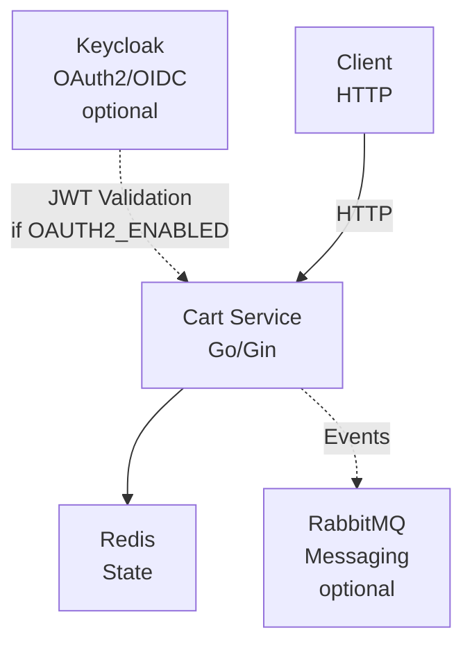
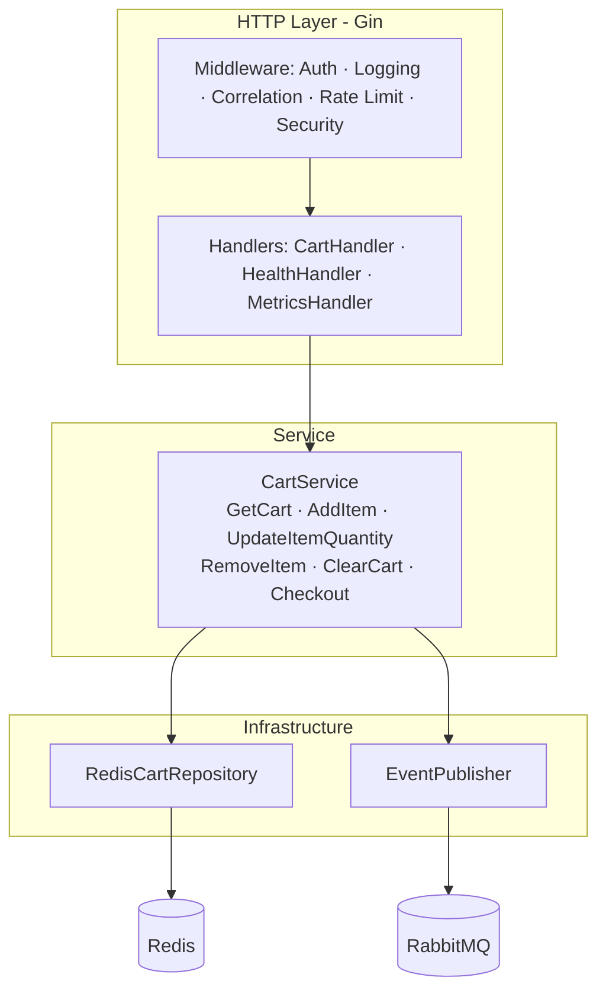

# Cart Service Architecture

## Overview

The Cart Service is a stateless Go microservice that manages shopping cart sessions using Redis for state storage.

## System Architecture



## Component Architecture



## Data Model

### Cart

```go
type Cart struct {
    ID          string      // UUID
    CustomerID  string      // From JWT subject
    Items       []CartItem  // Cart items
    TotalAmount float64     // Calculated total
    Currency    string      // Default: USD
    CreatedAt   time.Time
    UpdatedAt   time.Time
    ExpiresAt   time.Time   // TTL-based expiration
}

type CartItem struct {
    ID        string   // UUID
    ProductID string   // Reference to product
    Name      string   // Product name
    Quantity  int      // Item quantity
    UnitPrice float64  // Price per unit
    SubTotal  float64  // Quantity * UnitPrice
}
```

### Redis Key Pattern

```
cart:{customerID}
```

Example:
```
cart:user-123 -> {"id":"...", "customerId":"user-123", "items":[...]}
```

## Request Flow

### Add Item to Cart

```
1. Client sends POST /api/v1/cart/items with JWT
2. Auth middleware validates JWT, extracts customer ID
3. CartHandler parses and validates request
4. CartService.AddItem():
   a. Gets existing cart or creates new
   b. Adds/updates item
   c. Recalculates total
   d. Saves to Redis
   e. Publishes cart.updated event
5. Returns updated cart
```

### Checkout Flow

```
1. Client sends POST /api/v1/cart/checkout with shipping address
2. CartService.Checkout():
   a. Retrieves cart
   b. Validates cart is not empty
   c. Publishes cart.checkout event
   d. Clears cart in Redis
3. Order Service receives cart.checkout event
4. Order Service creates order
```

## Event Publishing

### Event Types

| Event | Routing Key | Description |
|-------|-------------|-------------|
| CartCreatedEvent | cart.created | New cart created |
| CartUpdatedEvent | cart.updated | Items modified |
| CartClearedEvent | cart.cleared | Cart emptied |
| CartCheckoutEvent | cart.checkout | Checkout initiated |

### Event Envelope

```json
{
  "id": "uuid",
  "type": "cart.checkout",
  "version": "1.0",
  "timestamp": "2024-01-15T10:30:00Z",
  "source": "cart-service",
  "correlationId": "uuid",
  "data": {
    "cartId": "...",
    "customerId": "...",
    "items": [...],
    "totalAmount": 99.99,
    "shippingAddress": {...}
  }
}
```

## Configuration

### Environment Variables

| Variable | Description | Default |
|----------|-------------|---------|
| `SERVER_PORT` | HTTP port | `8083` |
| `REDIS_HOST` | Redis host | `localhost` |
| `REDIS_PORT` | Redis port | `6379` |
| `REDIS_PASSWORD` | Redis password | - |
| `REDIS_DB` | Redis database | `0` |
| `CART_TTL` | Cart expiration | `168h` (7 days) |
| `OAUTH2_ENABLED` | Enable OAuth2 | `false` |
| `OAUTH2_ISSUER_URI` | Keycloak URL | - |
| `OAUTH2_CLIENT_ID` | OAuth2 client | `cart-service` |
| `RABBITMQ_HOST` | RabbitMQ host | `localhost` |
| `RABBITMQ_PORT` | RabbitMQ port | `5672` |
| `LOG_LEVEL` | Log level | `info` |
| `RATE_LIMIT_RPS` | Rate limit | `100` |

## Security

### Authentication

1. JWT tokens issued by Keycloak
2. Validated using JWKS endpoint
3. Customer ID extracted from `sub` claim
4. Roles extracted from `realm_access.roles`

### Authorization

- All cart operations require authentication
- Customer can only access their own cart
- Admin roles can access any cart (future)

### Security Headers

- X-XSS-Protection
- X-Frame-Options: DENY
- X-Content-Type-Options: nosniff
- Content-Security-Policy
- Strict-Transport-Security (HTTPS)

### Rate Limiting

- Per-IP rate limiting
- Default: 100 requests/second
- Returns 429 with Retry-After header

## Observability

### Logging

Structured JSON logging with zap:
```json
{
  "timestamp": "2024-01-15T10:30:00Z",
  "level": "info",
  "message": "item added to cart",
  "cartId": "...",
  "productId": "...",
  "quantity": 2
}
```

### Metrics

Prometheus metrics exposed at `/metrics`:
- `http_requests_total`
- `http_request_duration_seconds`
- Custom cart operation metrics

### Health Checks

| Endpoint | Purpose |
|----------|---------|
| `/health` | Overall health + Redis status |
| `/health/live` | Liveness probe |
| `/health/ready` | Readiness probe (Redis check) |

## Performance

### Targets

- API latency: p50 < 10ms, p99 < 50ms
- Throughput: > 1000 req/sec
- Redis operations: < 5ms

### Optimizations

- Connection pooling to Redis
- JSON serialization for cart data
- In-memory rate limiting
- Stateless design for horizontal scaling

## Deployment

### Kubernetes

- 2 replicas minimum
- Rolling update strategy
- Pod anti-affinity for HA
- Resource limits enforced
- Non-root container
- Read-only filesystem

### Dependencies

| Service | Required | Purpose |
|---------|----------|---------|
| Redis | Yes | Cart state storage |
| Keycloak | Optional | Authentication |
| RabbitMQ | Optional | Event publishing |
